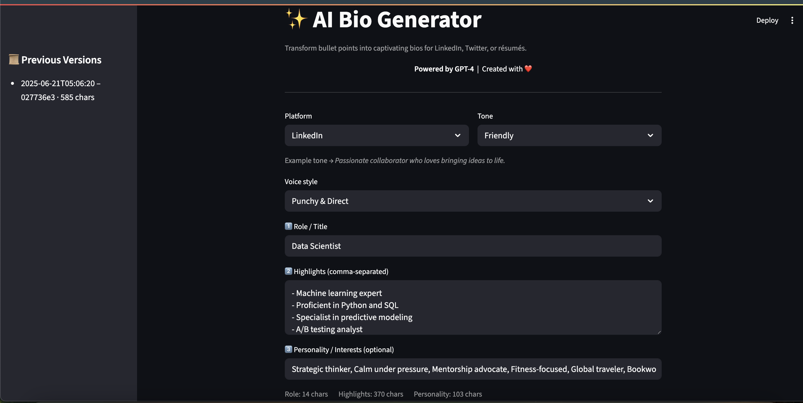

# ✨ AI Bio Generator

Transform simple bullet points into captivating professional bios for **LinkedIn**, **Twitter**, or **résumés** — powered by **GPT-4**.



## 🔗 Live Demo

👉 [Launch the App on Streamlit](https://ai-bio-generator.streamlit.app)

---

## 🚀 Features

- 🎯 Tailored bios for LinkedIn, Twitter, or résumés
- 🧠 Tone control: Executive, Funny, Casual, Bold, Friendly
- 💬 Voice style options: Punchy, Conversational, Visionary, etc.
- ⚙️ Bullet point optimizer using GPT-4o-mini
- 🧑‍🎨 Optional personality integration
- 📄 PDF download + social share buttons (LinkedIn & Twitter)
- ✅ GPT-4 "Powered By" branding

---

## 🛠 Tech Stack

- [Streamlit](https://streamlit.io/) – Frontend UI framework
- [OpenAI Python SDK](https://github.com/openai/openai-python) – API calls to GPT-4o
- [FPDF](https://pyfpdf.readthedocs.io/) – PDF download support
- [Python 3.9+](https://www.python.org/)

---

## 📦 Local Setup

> Clone and run locally with your OpenAI API key

### 1. Clone the Repo

```bash
git clone https://github.com/haystackz12/ai-bio-generator.git
cd ai-bio-generator

## 🧠 Credits

Built by [@haystackz12](https://github.com/haystackz12) with 💡, ☕, and [OpenAI](https://openai.com/).

---

## 📄 License

[MIT License](LICENSE)
